# Sign Language Recognition System (SLRS)

> **Author**: Mohamed Amine Trabelsi &nbsp;|&nbsp; [GitHub](https://github.com/trabelssi) &nbsp;|&nbsp; [LinkedIn](https://www.linkedin.com/in/trabelsi-mohamed-amine/)

A real-time sign language gesture recognition system designed to enhance accessibility and communication for the deaf and hard of hearing community.

## 🎯 Project Overview

This graduation project implements a highly accurate, deep learning-based sign language recognition system capable of identifying and classifying hand gestures in real-time through webcam input.

## ✨ Key Features

- **Multi-Class Classification**: Recognizes 6 distinct sign language gestures (call, mute, peace, ok, stop, palm)
- **Real-Time Processing**: Live webcam feed analysis with instant gesture detection
- **Audio Feedback Option**: Text-to-speech integration for announcing detected gestures
- **Transfer Learning**: Leverages ResNet50V2 pre-trained model for superior accuracy
- **GPU Acceleration**: Optimized for GPU inference when available, with CPU fallback
- **High Accuracy**: 95% test accuracy achieved through extensive training on 10,380+ images

## 📊 Dataset Summary

- **Total Images**: 10,380 RGB Full HD images from HaGRID dataset
- **Classes**: 6 gesture classes (peace, stop, call, palm, ok, mute)
- **Training Set**: 8,280 images (1,380 per class)
- **Validation Set**: 2,100 images (350 per class)
- **Test Set**: 1,200 images (200 per class)

## 📁 Project Structure

```
-Sign-Language-Recognition-System-SLRS-/
├── CLASS WITH AUDIO.py                 # Live detection with text-to-speech
├── CLASS WITHOUT AUDIO.py              # Live detection (silent/optimized)
├── train_model.py                      # Model training script
├── model_training_notebook.ipynb       # Interactive training notebook
├── model.h5                            # Pre-trained model weights (245 MB)
├── requirements.txt                    # Python dependencies
├── README.md                           # This file
├── MODEL_INFO.md                       # Detailed model documentation
├── QUICK_START.md                      # 5-minute setup guide
└── doc/
    ├── images/                         # Diagrams, results, and hardware photos
    └── report/
        └── back up plan of pfe.docx    # Original project report
```

## 🚀 Installation & Setup

### 1. Clone the Repository
```bash
git clone https://github.com/trabelssi/-Sign-Language-Recognition-System-SLRS-.git
cd -Sign-Language-Recognition-System-SLRS-
```

### 2. Install Dependencies
```bash
pip install -r requirements.txt
```

### 3. Verify Model File
Ensure `model.h5` is present in the project root directory. This file contains the pre-trained model weights.

### 4. Test Your Setup
```bash
python "CLASS WITHOUT AUDIO.py"
```

## 🎮 Usage

### Real-Time Recognition with Audio Feedback
```bash
python "CLASS WITH AUDIO.py"
```
Detects gestures and announces them via text-to-speech when confidence > 90%.

### Real-Time Recognition (Silent Mode)
```bash
python "CLASS WITHOUT AUDIO.py"
```
Optimized for devices like Raspberry Pi and low-powered laptops.

### Training a New Model
```bash
python train_model.py
```
Or use the Jupyter notebook `model_training_notebook.ipynb` for interactive training.

## 🛠️ Technical Details

- **Deep Learning Framework**: TensorFlow/Keras
- **Base Architecture**: ResNet50V2 with transfer learning (60 layers frozen)
- **Input Resolution**: 224×224 pixels (RGB)
- **Camera Resolution**: 320×240 pixels
- **Confidence Threshold**: 75% (audio feedback at 90%+)
- **Batch Size**: 8
- **Learning Rate**: 0.0001
- **Epochs**: 20
- **Training Time**: ~7 hours on Google Colab GPU
- **Audio Engine**: pyttsx3 for text-to-speech
- **Model File**: `model.h5` (ResNet50V2-based, 95% accuracy)

## 💻 Requirements

### Software Dependencies
- Python 3.x
- TensorFlow/Keras (for deep learning)
- OpenCV (cv2) (for image processing and computer vision)
- NumPy (for numerical computation)
- Pandas (for data manipulation)
- PIL/Pillow (for image handling)
- pyttsx3 (for text-to-speech audio feedback)
- Matplotlib (for visualization during training)

### Hardware Requirements
- **Minimum**: CPU-based inference (slower)
- **Recommended**: NVIDIA GPU with CUDA support for faster inference
- **Deployment**: Raspberry Pi 4 (4GB+ RAM recommended) with USB camera

## 🎓 Academic Context

This project was developed as a graduation project (PFE - Projet de Fin d'Études), demonstrating the application of deep learning and computer vision techniques to solve real-world accessibility challenges.

---

## 📖 Detailed Methodology

### Transfer Learning Approach

This approach allows us to leverage the knowledge previously acquired by the pre-trained model, thus reducing the need to train everything from scratch. After a thorough analysis of the results, we chose **ResNet50V2** as our preferred model due to its advanced architecture, high performance, and superior accuracy.

### Global Model Architecture

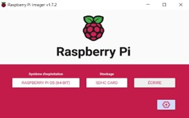
*Figure 13: Global Model Architecture*

The figure above presents a clear and understandable overview of our proposed model's global architecture. This model consists of different parts that play an essential role in the process:

1. **Pre-processing Phase**: Work with the database including:
   - Data augmentation to expand and diversify our dataset
   - Database division for different learning phases
   - Image normalization to standardize format

2. **CNN Core**: ResNet50V2 architecture responsible for:
   - Feature extraction from images
   - Decision making

---

## 🗂️ Dataset Details

### HaGRID Dataset

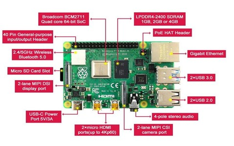
*Figure 14: Sample images from the database*

We used the complete **HaGRID (HAnd Gesture Recognition Image Dataset)** for training:

- **Total Images**: 10,380 RGB images in Full HD
- **Classes**: 6 gesture classes (peace, stop, call, palm, ok, mute)
- **Subjects**: Age range 18-65 years
- **Environment**:
  - Primarily indoor captures
  - Significant lighting variation (artificial and natural)
  - Extreme conditions (subjects facing/backing windows)
  - Distance range: 0.5 to 4 meters from camera

### Dataset Partitioning

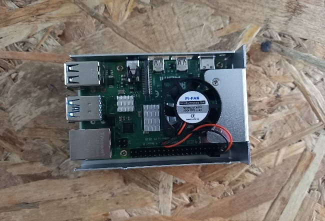
*Figure 15: Dataset partitioning*

- **Training Set**: 79.24% (8,280 images, 1,380 per class)
- **Validation Set**: 20.21% (2,100 images, 350 per class)
- **Test Set**: 11.55% (1,200 images, 200 per class)

### Data Augmentation

Applied augmentation techniques in training and validation folders:
- Rotation
- Horizontal and vertical shifts
- Shear transformation
- Zoom
- Horizontal flip

These techniques increase training example variability, helping the model generalize better and be more resistant to variations in real data.

---

## 🧠 CNN Model Architecture

### ResNet50V2 Architecture

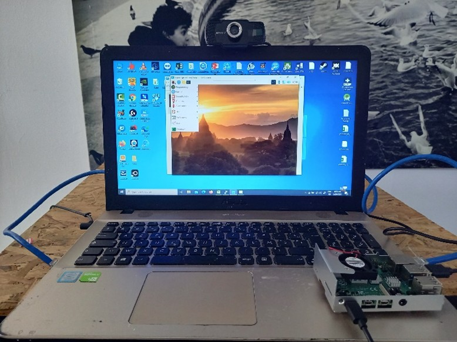
*Figure 16: ResNet50V2 Architecture*

**Why ResNet50V2?**
- Demonstrated excellent performance in image classification tasks
- Trained on vast image datasets with high accuracy in various benchmarks
- Leverages pre-trained weights and learned representations
- Capable of extracting significant visual features from sign language gestures

**Architecture Stages**:

1. **Stage 1**: Input → Convolution → Normalization → ReLU → Max Pooling
2. **Stages 2-5**: Convolution blocks and identity blocks with 3 convolution layers each
3. **Final Stage**: Average pooling → Flatten → Fully connected layer

---

## 🔬 Training Configuration

### Environment

- **Programming Language**: Python
- **Platform**: Google Colab (with GPU/TPU acceleration)
- **Key Libraries**:

| Library | Purpose |
|---------|---------|
| TensorFlow | Deep learning framework for AI model creation |
| NumPy | Numerical computation and array manipulation |
| OpenCV | Image processing and computer vision |
| Pandas | Data manipulation and analysis |

### Training Parameters

After extensive experimentation, we determined optimal parameters:

#### 1. Learning Rate: 0.0001

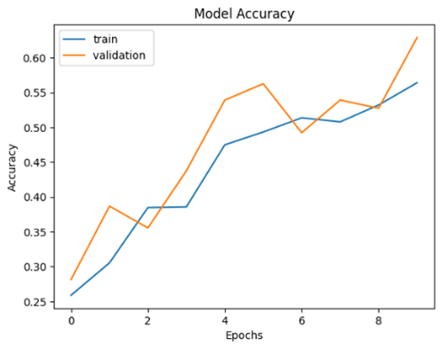
*Figure 19: Loss and Accuracy with learning rate 0.0001*

Tested rates: 0.00001, 0.0001, 0.001. Selected **0.0001** as it provides a good starting point and works well for most deep learning tasks.

#### 2. Freezing Layers: 60 layers frozen

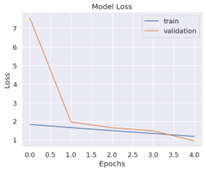
*Figure 22: Loss and Accuracy with freezing layer configuration*

Tested freezing 0, 30, and 60 layers. Chose **60 frozen layers** for optimal balance between accuracy and execution time.

#### 3. Batch Size: 8

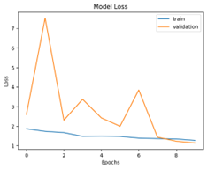
*Figure 23: Loss and Accuracy with batch size 8*

Tested sizes: 8, 16, 32. Selected **batch size 8** for best generalization and accuracy.

#### 4. Epochs: 20

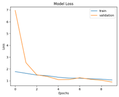
*Figure 28: Precision and Loss of Hand Gesture Recognition Model*

Tested 5, 10, and 20 epochs. Selected **20 epochs** for optimal performance, though overfitting was observed after epoch 17. Training duration: approximately 7 hours on Google Colab.

---

## 📊 Evaluation Metrics

### Formulas

- **Accuracy**: `(TP + TN) / (TP + TN + FN + FP)`
- **Precision**: `TP / (TP + FP)`
- **Recall**: `TP / (TP + FN)`
- **F1-Score**: `2 × (Precision × Recall) / (Precision + Recall)`

Where:
- **TP** (True Positives): Correctly predicted positive instances
- **TN** (True Negatives): Correctly predicted negative instances
- **FN** (False Negatives): Positive instances incorrectly predicted as negative
- **FP** (False Positives): Negative instances incorrectly predicted as positive

---

## 🎯 Results

### Model Performance

**Test Accuracy**: 95%

The accuracy and loss curves show the evolution of ResNet50V2 model performance across epochs, achieving 95% accuracy on test data with satisfactory validation precision, demonstrating model robustness.

### Confusion Matrix


*Figure 29: Confusion Matrix*

The normalized confusion matrix highlights the model's ability to detect positive samples. Most positive samples are correctly predicted, except for "mute" and "ok" classes.

### Classification Performance

| Gesture | Precision | Recall | F1-Score | Accuracy |
|---------|-----------|--------|----------|----------|
| Call    | 0.42      | 0.45   | 0.44     | 0.83     |
| Mute    | 1.00      | 0.02   | 0.04     | 0.97     |
| Ok      | 0.44      | 0.26   | 0.33     | 0.82     |
| Palm    | 0.71      | 0.81   | 0.75     | 0.86     |
| Peace   | 0.38      | 0.39   | 0.38     | 0.80     |
| Stop    | 0.70      | 0.63   | 0.67     | 0.92     |

---

## 🔧 Hardware Implementation

### Raspberry Pi 4 Deployment

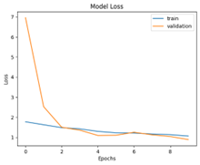
*Figure 30: Hardware components used*

#### Components Used:
- Raspberry Pi 4 Model B
- USB Camera
- Ethernet cable
- Power adapter

#### Raspberry Pi 4 Specifications

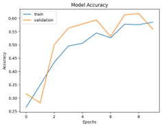
*Figure 31: Raspberry Pi 4*

| Component | Specification |
|-----------|--------------|
| **Processor** | Broadcom BCM2711, quad-core Cortex-A72 (ARM v8) 64-bit @ 1.5GHz |
| **RAM** | 8 GB LPDDR4 |
| **GPU** | VideoCore VI, OpenGL ES 3.0, HEVC 4K@60fps |
| **Wireless** | Bluetooth 5.0, Wi-Fi 802.11b/g/n/ac |
| **Wired** | Gigabit Ethernet (RJ45) |
| **Ports** | 2× USB 3.0, 2× USB 2.0, 1× USB-C (power), 2× micro-HDMI, 1× GPIO 40-pin |
| **Power** | 5V DC via USB-C (minimum 3A) |
| **Dimensions** | 85.60 mm × 56.5 mm × 11 mm |
| **Weight** | 40 g |

#### Internal Architecture

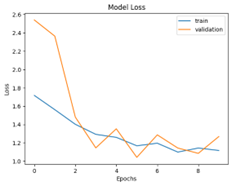
*Figure 32: Raspberry Pi 4 internal architecture*

### Setup Process

#### 1. Raspberry Pi Imager Installation

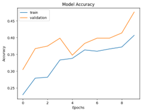
*Figure 33: Raspberry Pi Imager interface*

Steps:
1. Install Raspbian OS on micro SD card
2. Configure Raspbian settings
3. Enable SSH with username: `pi`, password: `pi`
4. Write OS to SD card

#### 2. Network Configuration

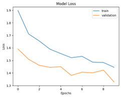
*Figure 34: Adding SSH configuration*

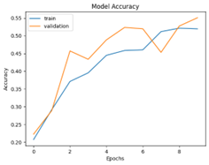
*Figure 35: Adding Raspberry Pi IP*

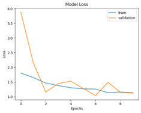
*Figure 36: Adding Ethernet IP*

#### 3. Remote Access Setup

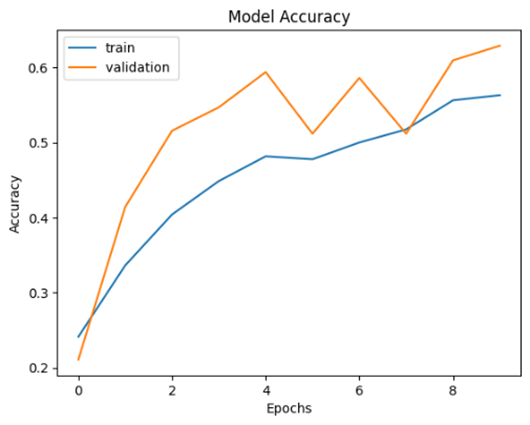
*Figure 37: Raspberry Pi cable connections*

**Using VNC Viewer**:

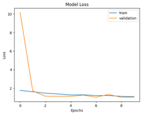
*Figure 38: VNC Viewer interface*

#### 4. USB Camera

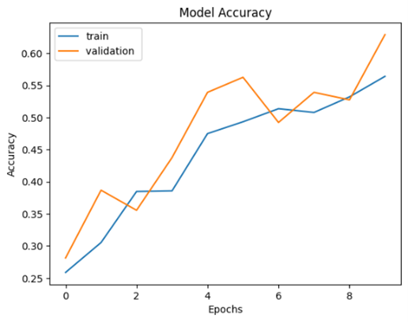
*Figure 39: USB Camera for Raspberry Pi*

The USB camera is a fundamental component for implementing our vision system, capturing and analyzing hand movements for accurate and reliable gesture recognition.

---

## 🎬 Real-Time Implementation

### System Workflow

1. **Camera Configuration**: Set resolution and brightness for optimal results
2. **Model Loading**: Load pre-trained .h5 model
3. **Image Preprocessing**: Resize images and normalize pixel values
4. **Prediction**: Submit preprocessed images to model for gesture classification
5. **Results Display**: Show gesture class name and probability on screen
6. **Real-time Loop**: Continuous capture, processing, and display
7. **Resource Release**: Close camera connection and windows when finished

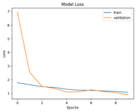
*Figure 40: Real-time gesture recognition test*

### Graphical Interface

We developed a graphical interface for the hand sign recognition system that:
- Accepts hand sign images as input
- Provides corresponding words for each detected sign
- Displays results as written text
- Offers optional text-to-speech output

This dual presentation provides better understanding and more complete, accessible communication.

---

## 📦 Model Information

### About model.h5

The `model.h5` file is the core of this project - a trained deep learning model achieving **95% accuracy** on the test set.

**Quick Facts**:
- **Architecture**: ResNet50V2 with transfer learning
- **Training Dataset**: 10,380 images from HaGRID
- **Training Duration**: ~7 hours on Google Colab GPU
- **Gesture Classes**: 6 (call, mute, peace, ok, stop, palm)
- **Input Size**: 224×224 RGB images
- **File Format**: HDF5 (.h5)

For complete model documentation, see [`MODEL_INFO.md`](MODEL_INFO.md)

### Loading the Model in Your Code

```python
from keras.models import load_model
import numpy as np
from PIL import Image

# Load model
model = load_model('model.h5')

# Preprocess image
def preprocess(image_path):
    img = Image.open(image_path)
    img = img.resize((224, 224))
    img = np.array(img).astype('float32') / 255.0
    return img.reshape(1, 224, 224, 3)

# Predict
predictions = model.predict(preprocess('your_image.jpg'))
class_names = ['call', 'mute', 'peace', 'ok', 'stop', 'palm']
gesture = class_names[np.argmax(predictions)]
confidence = np.max(predictions) * 100
print(f"{gesture}: {confidence:.2f}%")
```

---

## 🤝 Contributing

If you'd like to contribute improvements:

1. Fork the repository
2. Create a feature branch (`git checkout -b feature/improvement`)
3. Commit your changes (`git commit -am 'Add new feature'`)
4. Push to the branch (`git push origin feature/improvement`)
5. Create a Pull Request

## 📄 License

See [LICENSE](LICENSE) file for details.

## 🙏 Acknowledgments

- **HaGRID Dataset** - For providing the comprehensive hand gesture dataset
- **Google Colab** - For providing free GPU resources for model training
- **ResNet50V2** - Pre-trained model from Keras Applications
- **Raspberry Pi Foundation** - For the hardware platform enabling edge deployment

## 📧 Contact

**Mohamed Amine Trabelsi**

- 🐙 GitHub: [@trabelssi](https://github.com/trabelssi)
- 💼 LinkedIn: [trabelsi-mohamed-amine](https://www.linkedin.com/in/trabelsi-mohamed-amine/)

For questions or collaboration opportunities, feel free to reach out via GitHub or LinkedIn.

---

**Author**: Mohamed Amine Trabelsi
**Project Type**: Graduation Project (PFE - Projet de Fin d'Études)
**Domain**: Deep Learning, Computer Vision, Accessibility Technology
**Year**: 2025
**Status**: ✅ Complete
